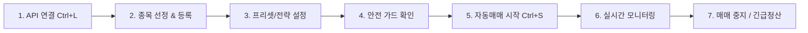
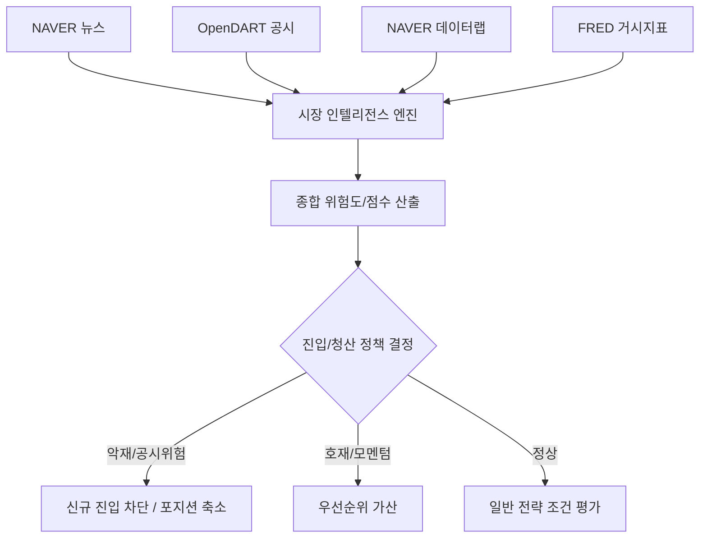
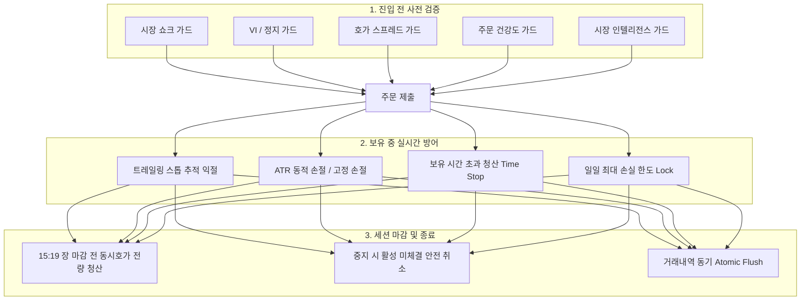

# 🚀 Kiwoom Pro Algo-Trader v4.5

> **키움증권 REST API 기반 프리미엄 주식 자동매매 & 알고리즘 트레이딩 도우미**  
> 직관적인 PyQt6 GUI 대시보드, 13종의 퀀트 전략 및 보조지표, 다중 안전 가드(Fail-Closed), 실시간 시장 인텔리전스(뉴스·공시·매크로)를 지원합니다.

<div align="center">


</div>

---

## 📋 목차

1. [📖 프로그램 소개](#-프로그램-소개)
2. [⚡ 빠른 시작 (5분 완성)](#-빠른-시작-5분-완성)
3. [🔐 키움 REST API 연동 및 모드 설정](#-키움-rest-api-연동-및-모드-설정)
4. [🧭 실전 사용 워크플로우 (Step-by-Step)](#-실전-사용-워크플로우-step-by-step)
5. [🖥️ 메인 화면 및 UI 탭 상세 가이드](#️-메인-화면-및-ui-탭-상세-가이드)
   - [상단 대시보드](#1-상단-대시보드-항상-표시)
   - [🎯 핵심 설정 탭](#2--핵심-설정-탭-초보자-추천)
   - [🛠 상세 설정 탭 (6개 하위 탭)](#3--상세-설정-탭-6개-서브-분류)
   - [🧠 시장 인텔리전스 (설정 / 현황 / 리플레이)](#4--시장-인텔리전스-설정--현황--리플레이)
   - [📈 시장 분석 탭 (차트 / 호가 / 조건검색 / 순위)](#5--시장-분석-탭-차트--호가--조건검색--순위)
   - [📊 데이터 및 진단 탭 (통계 / 내역 / 시스템 진단)](#6--데이터-및-진단-탭-통계--내역--시스템-진단)
6. [💡 주요 부가 기능 활용법](#-주요-부가-기능-활용법)
   - [수동 주문 (`Ctrl+O`) & 지정가 분할 매수](#수동-주문-ctrlo--지정가-분할-매수)
   - [예약 매매 (스케줄러)](#예약-매매-스케줄러)
   - [프로필 & 프리셋 관리](#프로필--프리셋-관리)
   - [백테스트 엔진 실행](#백테스트-엔진-실행)
   - [알림 설정 (텔레그램 & 사운드)](#알림-설정-텔레그램--사운드)
7. [⌨️ 키보드 단축키](#️-키보드-단축키)
8. [🛡️ 리스크 관리 및 안전 메커니즘](#️-리스크-관리-및-안전-메커니즘)
9. [❓ 자주 묻는 질문 및 문제 해결 (FAQ)](#-자주-묻는-질문-및-문제-해결-faq)
10. [💻 개발자 가이드 및 프로젝트 구조](#-개발자-가이드-및-프로젝트-구조)
11. [⚠️ 주의사항 및 면책 조항](#️-주의사항-및-면책-조항)

---

## 📖 프로그램 소개

**Kiwoom Pro Algo-Trader v4.5**는 키움증권 REST API와 WebSocket 실시간 시세를 바탕으로 동작하는 고성능 주식 자동매매 프로그램입니다.

### 🌟 핵심 장점
- **안전 제일 설계 (Fail-Closed)**: 시장 급변(쇼크), VI 발동, 주문 실패 급증, 비정상 슬리피지 감지 시 신규 진입을 즉시 자동 차단합니다.
- **2단계 실행 모드**: 실제 자금 투입 전 신호만 검증할 수 있는 `신호 전용(signal_only)` 모드와 실주문 `실전(live)` 모드를 완벽 분리 지원합니다.
- **다중 계층 퀀트 전략**: 래리 윌리엄스 변동성 돌파를 기본으로 RSI, MACD, 볼린저밴드, DMI, 거래량, 다중 시간대(MTF), 종합 진입 점수 시스템을 결합합니다.
- **시장 인텔리전스 결합**: 네이버 뉴스, OpenDART 공시, 검색 트렌드, FRED 거시경제를 실시간 수집·점수화하여 리스크를 방어합니다.
- **OS 레벨 자격증명 보안**: Windows 자격 증명 관리자(Keyring)를 통해 API Secret을 안전하게 암호화 보관합니다.
- **모던 다크 테마 UI**: PyQt6 기반의 미려한 반응형 인터페이스, 시스템 트레이 백그라운드 구동, 윈도우 시작 시 자동 실행을 지원합니다.

---

## ⚡ 빠른 시작 (5분 완성)

### 1. 요구사항 확인
- **운영체제**: Windows 10 / 11 (64-bit 권장)
- **Python**: Python 3.10 이상
- **증권 계정**: 키움증권 계좌 및 REST API 서비스 신청 완료 계정

### 2. 설치 방법

```bash
# 1) 저장소 클론 (또는 다운로드)
git clone https://github.com/twbeatles/kiwoom-automatic-trader.git
cd kiwoom-automatic-trader

# 2) 런타임 필수 패키지 설치
pip install -r requirements.txt

# (선택) 개발/테스트 도구 설치
pip install -r requirements-dev.txt
```

### 3. 프로그램 실행

```bash
python "키움증권 자동매매.py"
```

---

## 🔐 키움 REST API 연동 및 모드 설정

### 1. API 키 발급
1. [키움증권 Open API 포털](https://openapi.kiwoom.com/)에 접속하여 로그인합니다.
2. 서비스 신청 메뉴에서 **REST API 신청**을 진행하고 **App Key** 및 **Secret Key**를 발급받습니다.
3. 모의투자를 진행할 경우 **모의투자 서비스**도 함께 신청합니다.

### 2. 프로그램 내 키 등록
1. 프로그램 실행 후 좌측 상단 탭에서 **🔐 API/알림**을 클릭합니다.
2. **앱 키(App Key)**와 **시크릿 키(Secret Key)**를 입력합니다.
3. 모의투자 계정인 경우 **[ ] 모의투자 사용** 체크박스를 활성화합니다.
4. **💾 전체 설정 저장** 버튼을 누르면 Windows Credential Manager(Keyring)에 암호화되어 안전하게 보관됩니다.

### 3. 모드별 동작 이해 (중요!)

| 구분 | 실행 모드 (Execution Mode) | API 연결 모드 | 주문 전송 여부 | 용도 |
|:---:|:---:|:---:|:---:|:---|
| **모의 검증 (기본)** | `signal_only` (신호 전용) | 모의/실전 | **전송 안 함** (감사 로그만 기록) | 전략 신호 발생 여부 검증 및 시뮬레이션 |
| **모의 실거래** | `live` (실거래) | 모의투자 | **모의 서버로 전송** | 가상 자금으로 체결/주문 사이클 전체 테스트 |
| **실전 매매** | `live` (실거래) | 실전투자 | **실제 거래소로 전송** | 실제 자금으로 자동매매 수행 (실거래 가드 확인 필수) |

> [!NOTE]
> 프로그램의 기본 실행 모드는 **`signal_only`**입니다. 실제 주문을 보내려면 **[🛠 상세 설정 > 주문/청산]**에서 실행 모드를 **`live`**로 변경해야 합니다.

---

## 🧭 실전 사용 워크플로우 (Step-by-Step)



### [Step 1] API 연결 및 계좌 확인
1. 상단 대시보드의 **🔌 API 연결** 버튼을 클릭하거나 단축키 `Ctrl+L`을 누릅니다.
2. 상태 표시가 `● 정상 연결`로 바뀌고, 드롭다운에 본인의 **계좌번호**가 나타납니다.
3. 계좌를 선택하면 **예수금**과 **당일손익**이 자동으로 조회됩니다.

### [Step 2] 감시 종목 등록
- **직접 입력**: **🎯 핵심 설정** 탭의 `🧾 종목 입력`란에 6자리 종목코드를 쉼표(`,`)로 구분하여 입력합니다.  
  *(예: `005930,000660,042700,005380`)*
- **종목 검색 창 활용 (`Ctrl+F`)**: 종목명을 검색하여 더블클릭으로 손쉽게 추가할 수 있습니다.
- **즐겨찾기 저장**: 자주 쓰는 종목 묶음은 `⭐ 저장` 버튼을 눌러 즐겨찾기에 등록해 두고 원클릭으로 불러올 수 있습니다.

### [Step 3] 전략 및 수치 설정
- 초보자는 대시보드의 **📋 프리셋** 버튼(`Ctrl+Shift+P`)을 눌러 `표준(Standard)` 또는 `보수적(Conservative)` 프리셋을 적용하는 것을 권장합니다.
- **🎯 핵심 설정**에서 주요 수치를 확인합니다:
  - **한 종목 투자 비중**: 1회 진입 시 예수금 대비 배분율 (예: `10.0%`)
  - **목표가 민감도(K)**: 변동성 돌파 K값 (기본 `0.5`, 값이 클수록 돌파 기준이 높아져 신중한 진입)
  - **이익 보호 시작**: 트레일링 스톱이 가동되는 수익률 (예: `3.0%`)
  - **추적 손절 폭**: 최고점 대비 하락 시 매도할 비율 (예: `1.5%`)
  - **최대 손절률**: 매수가 대비 하락 시 무조건 손절할 비율 (예: `2.0%`)

### [Step 4] 자동매매 시작
1. 대시보드의 **🚀 자동매매 시작** 버튼을 클릭하거나 단축키 `Ctrl+S`를 누릅니다.
2. 실전 투자(`live`) 모드일 경우 실거래 확인 팝업이 뜨며, 최종 동의 후 매매 세션이 활성화됩니다.
3. 상태 표시줄이 `🟢 매매 중`으로 전환되며 유니버스 초기화 및 실시간 데이터 구독이 시작됩니다.

### [Step 5] 실시간 모니터링 및 운용
- 하단 **종목 테이블**에서 각 종목의 `현재가`, `목표가`, `상태(감시/보유/청산)`, `수익률`, `투자금`을 실시간으로 확인합니다.
- 하단 **로그 영역**을 통해 전략 판정, 호가 수신, 가드 발동 상황이 실시간으로 출력됩니다.

### [Step 6] 매매 중지 및 긴급 대응
- **정상 종료**: **⏹️ 중지** 버튼(`Ctrl+Q`)을 클릭합니다. 활성 미체결 주문을 안전하게 취소하고 감시를 종료합니다. (보유 주식은 유지)
- **긴급 전량 청산**: 시장 급락 등 비상 상황 시 **🚨 긴급 전량청산** 버튼(`Ctrl+Shift+X`)을 누르면 모든 보유 종목을 시장가로 즉시 일괄 매도합니다.

---

## 🖥️ 메인 화면 및 UI 탭 상세 가이드

```text
┌────────────────────────────────────────────────────────────────────────┐
│ 📊 자동매매 대시보드 (API 연결 / 계좌 / 예수금 / 손익 / 시작 / 중지 / 긴급청산)   │
├────────────────────────────────────────────────────────────────────────┤
│ [🎯핵심설정] [🛠상세설정] [🧠인텔리전스설정] [🔐API/알림] [📈차트] [📋호가] ... │
│                                                                        │
│                          (탭별 세부 작업 영역)                            │
│                                                                        │
├────────────────────────────────────────────────────────────────────────┤
│ 📋 실시간 감시/보유 종목 테이블 (현재가, 목표가, 상태, 매입가, 수익률 등)         │
├────────────────────────────────────────────────────────────────────────┤
│ 📝 시스템 & 매매 실시간 로그 콘솔                                       │
└────────────────────────────────────────────────────────────────────────┘
```

### 1. 상단 대시보드 (항상 표시)
- **🔌 API 연결**: REST API 로그인 및 토큰 발급/세션 초기화
- **계좌 선택 드롭다운**: 조회할 계좌번호 선택
- **💰 예수금 / 📈 당일손익**: 실시간 잔고 및 실현 손익 현황
- **🚀 자동매매 시작 (`Ctrl+S`) / ⏹️ 중지 (`Ctrl+Q`) / 🚨 긴급 전량청산 (`Ctrl+Shift+X`)**
- **📋 프리셋 (`Ctrl+Shift+P`) / 🔍 종목검색 (`Ctrl+F`)**

---

### 2. 🎯 핵심 설정 탭 (초보자 추천)
가장 핵심적인 5대 파라미터를 직관적으로 구성한 탭입니다.

| 항목 | 설명 | 권장 기본값 |
|:---|:---|:---:|
| **즐겨찾기 / 종목 입력** | 감시 대상 6자리 종목코드 (쉼표 구분) | `005930,000660` |
| **한 종목 투자 비중** | 1개 종목 진입 시 사용할 예수금 비율 (%) | `10.0 %` |
| **목표가 민감도 (K)** | 변동성 돌파 진입 계수 ($목표가 = 시가 + 전일변동폭 \times K$) | `0.5` |
| **이익 보호 시작** | 최고 수익률 추적(트레일링 스톱)을 개시할 수익률 기준 | `3.0 %` |
| **추적 손절 폭** | 도달한 최고 수익률 대비 밀렸을 때 청산할 폭 | `1.5 %` |
| **최대 손절률** | 매수가 대비 고정 손절선 | `2.0 %` |

---

### 3. 🛠 상세 설정 탭 (6개 서브 분류)

#### ① [진입 판단] 탭
- **RSI 과열 필터**: RSI가 과열 기준(기본 70) 이상일 때 고점 매수 방지
- **MACD 추세 확인**: MACD가 시그널선을 상향 돌파(골든크로스)한 상태에서만 진입
- **볼린저밴드 필터**: 상단 밴드 과열 여부 확인
- **DMI / ADX**: 추세 강도(ADX)가 일정 기준(기본 20) 이상인 강한 상승장에서만 진입
- **거래량 증가 확인**: 20일 평균 거래량 대비 N배(기본 1.5배) 이상 터질 때만 진입
- **이동평균 정배열**: 단기(5일) > 장기(20일) 정배열 조건 검증
- **스토캐스틱 RSI**: 단기 모멘텀 지표 필터
- **다중 시간대(MTF) 추세 일치**: 일봉과 분봉의 상승 추세가 일치할 때만 진입
- **시가 갭 분석**: 시가 갭 발생 정도에 따라 K값을 자동 보정
- **돌파 확인 후 진입**: 목표가 돌파 직후 낚시 방지를 위해 N틱 이상 유지될 때 체결
- **종합 점수 기준 (Entry Scoring)**: 각 지표를 점수화(0~100점)하여 기준 점수(기본 60점) 이상일 때만 진입
- **부분 익절**: +3%(30% 매도), +5%(30% 매도), +8%(20% 매도) 등 단계별 분할 익절

#### ② [리스크 관리] 탭
- **일일 손실 한도**: 당일 누적 손실률(기본 -3%) 도달 시 자동매매 즉시 강제 중지
- **동시 보유 종목 수 제한**: 최대 보유 종목 수(기본 5개) 초과 매수 금지
- **ATR 변동성 손절**: 종목의 일일 변동폭(ATR)의 N배를 동적 손절선으로 적용
- **시장 분산 제한**: 코스피/코스닥 한 시장의 쏠림 비중 제한 (기본 최대 70%)
- **업종 집중 제한**: 동일 섹터(업종) 투자 비중 제한 (기본 최대 30%)
- **동적 포지션 사이징 (Anti-Martingale)**: 연속 손실 시 투자 비중 자동 축소 (50% 감축 등)
- **ATR 기반 주문 크기**: 변동성이 큰 종목은 적게, 작은 종목은 많이 매수하여 리스크 균등화

#### ③ [주문/청산] 탭
- **지정가 분할 매수**: `지정가 우선` 주문 시 목표가 아래로 N회 분할 지정가 동시 제출
- **재진입 대기 시간(쿨다운)**: 손절 또는 청산 후 동일 종목 재진입 제한 시간 (기본 10분)
- **보유 시간 초과 청산 (Time Stop)**: 진입 후 N분(기본 120분) 동안 목표 미도달 시 자동 청산
- **유동성 필터**: 20일 평균 거래대금이 기준(기본 50억) 미만인 소외주 진입 제외
- **호가 스프레드 제한**: 매수/매도 호가 갭이 넓은(기본 0.5% 초과) 슬리피지 위험 종목 진입 차단
- **실행 모드 선택**: `signal_only` (신호 전용) vs `live` (실제 주문 전송)

#### ④ [전략팩/백테스트] 탭
- **전략 묶음 선택**: 변동성 돌파, 추세 추종, 모멘텀, 이평 크로스 등 기본 전략팩 선택
- **포트폴리오 운용 방식**: Equal Weight(균등 배분), Risk Parity(위험 균등) 등
- **백테스트 실행기**:
  - 가격 CSV 파일(`symbol,ts,open,high,low,close,volume`)과 인텔리전스 JSONL 파일을 로드하여 이벤트 드리븐 백테스트 수행
  - 승률, 총 수익률, MDD, Sharpe Ratio, 개별 체결 내역 확인 및 결과 저장

#### ⑤ [시장 급변동 보호] 탭
- **시장 쇼크 보호**: 코스피/코스닥 지수가 1분(1.5%) 또는 5분(2.8%) 급락 시 전 종목 진입 일시 차단
- **VI / 거래정지 보호**: 변동성완화장치(VI) 발동 종목 및 해제 직후 쿨다운(7분) 동안 진입 차단
- **시장 상태별 비중 축소 (Regime Sizing)**: 시장 변동성이 극심한 날에는 자동 매수 수량 축소
- **슬리피지 보호**: 최근 주문의 체결 슬리피지가 기준(15 bps)을 초과하면 진입 보류
- **주문 실패 급증 보호 (Order Health)**: 거부/실패 주문이 연속 발생하면 시스템 보호 모드 진입

#### ⑥ [시스템] 탭
- **윈도우 시작 시 자동 실행**: 부팅 시 트레이더 자동 실행 레지스트리 등록
- **종료 시 트레이로 최소화**: 닫기(X) 버튼을 눌러도 종료되지 않고 윈도우 트레이로 이동
- **사운드 알림**: 매수/매도/익절/손절 시 효과음 재생
- **종료 시 거래내역 동기 저장**: 비정상 종료 시에도 당일 거래 기록 보존
- **보안 설정**: Keyring 실패 시 평문 저장 허용 여부 (기본값: 차단)

---

### 4. 🧠 시장 인텔리전스 (설정 / 현황 / 리플레이)

외부 정성적 데이터(뉴스, 공시, 트렌드, 거시지표)를 수집하여 정량적 룰에 따라 진입 및 방어에 반영하는 시스템입니다.



- **🧠 인텔리전스 설정 탭**:
  - NAVER API (Client ID/Secret), OpenDART API Key, FRED API Key 등록
  - 수집 주기(뉴스 60초, 매크로 300초 등) 및 점수/차단 기준치 설정
  - AI 요약 기능(선택): Gemini, OpenAI 등 LLM을 활용한 정밀 뉴스 요약
- **🧠 인텔리전스 현황 탭**:
  - 종목별 실시간 뉴스 점수, 공시 위험도, 테마 점수, 매크로 상태, 적용 정책 모니터링
- **📼 인텔리전스 리플레이 탭**:
  - 수집된 이벤트 로그(`data/market_intelligence_events.jsonl`) 및 시스템 결정 감사 로그(`data/decision_audit.jsonl`)를 시간대별로 재생/분석

---

### 5. 📈 시장 분석 탭 (차트 / 호가 / 조건검색 / 순위)
- **📈 차트**: 선택 종목의 분봉/일봉 캔들 차트 및 지표 시각화
- **📋 호가**: 10단계 매수/매도 실시간 잔량 및 호가 스프레드 모니터링
- **🔍 조건 검색**: 키움 HTS에서 작성한 사용자 조건검색식 목록을 불러와 실시간 포착 종목 감시
- **🏆 순위**: 거래량 상위, 등락률 상위, 시가총액 상위 등 시장 주도주 실시간 랭킹 조회

---

### 6. 📊 데이터 및 진단 탭 (통계 / 내역 / 시스템 진단)
- **📊 통계**: 총 거래 횟수, 승률, 누적 실현손익, 최대 수익/손실 실시간 집계
- **📝 내역**: 당일 체결된 모든 매수/매도 내역 테이블 확인 및 **📤 CSV 내보내기 (`Ctrl+E`)**
- **🩺 시스템 진단**:
  - 24개 진단 컬럼을 통해 각 종목의 대기 주문 상태, 동기화 상태, 가드 차단 사유 실시간 분석
  - 통신 이상으로 고착된 종목에 대해 `선택 종목 재동기화` 및 `동기화 실패(sync_failed) 해제 요청` 버튼 제공

---

## 💡 주요 부가 기능 활용법

### 수동 주문 (`Ctrl+O`) & 지정가 분할 매수
- 자동매매 중에도 특정 종목을 직접 매매하고 싶을 때 단축키 `Ctrl+O`를 누릅니다.
- 종목코드, 매수/매도 구분, 수량, 시장가/지정가를 지정하여 즉시 주문을 제출합니다.
- 실계좌 모드에서는 안전 확인 창이 호출되며, 예수금 및 보유 잔고가 즉각 동기화됩니다.
- **분할 매수**: 상세 설정에서 `분할 매수`를 켜고 주문 방식을 `지정가 우선`으로 두면, 1차 진입가 아래로 설정한 간격(예: 0.5%)마다 다건의 분할 지정가 주문이 자동 제출됩니다.

### 예약 매매 (스케줄러)
- 상단 메뉴의 **[도구 > ⏰ 예약 매매]**를 클릭합니다.
- **시작 시간**(예: `08:59:00`)과 **종료 시간**(예: `15:19:00`)을 지정하고 활성화해 두면, 정해진 시간에 자동으로 API 연결, 유니버스 초기화, 매매 시작 및 전량 청산/중지가 수행됩니다.

### 프로필 & 프리셋 관리
- **프리셋 (`Ctrl+Shift+P`)**: `공격적`, `표준`, `보수적`, `스캘핑` 등 사전 정의된 매매 수치를 한 번의 클릭으로 로드합니다.
- **프로필 관리 (`Ctrl+P`)**: 본인만의 종목군 및 설정 세트를 `단타_세팅`, `대형주_스윙` 등의 이름으로 여러 개 저장하고 필요할 때마다 즉시 전환할 수 있습니다.

### 백테스트 엔진 실행
1. **[🛠 상세 설정 > 전략팩/백테스트]** 탭으로 이동합니다.
2. 준비된 주가 데이터 CSV 파일 경로를 선택합니다.
3. 수수료(기본 5 bps), 슬리피지(기본 3 bps), 대상 기간을 입력합니다.
4. **[백테스트 실행]** 버튼을 누르면 백그라운드 Worker 스레드에서 시뮬레이션이 진행되며, 완료 후 수익률 곡선 및 세부 지표가 출력됩니다.

### 알림 설정 (텔레그램 & 사운드)
1. **텔레그램 알림**:
   - 텔레그램 `@BotFather`를 통해 봇을 생성하고 `Bot Token`을 발급받습니다.
   - `@userinfobot` 등을 통해 본인의 `Chat ID`를 확인합니다.
   - **🔐 API/알림** 탭에 토큰과 챗 ID를 입력하고 **[x] 텔레그램 알림 사용**을 체크합니다.
   - 매수/매도 체결, 일일 손실 한도 도달, 긴급 청산 발생 시 실시간 메시지가 전송됩니다.
2. **사운드 알림**:
   - **[🛠 상세 설정 > 시스템]**에서 **[x] 사운드 알림**을 활성화하면 주요 이벤트 발생 시 오디오 효과음이 출력됩니다.

---

## ⌨️ 키보드 단축키

트레이딩 중 신속한 조작을 위해 12가지 글로벌 단축키를 지원합니다.

| 단축키 | 기능 | 설명 |
|:---|:---|:---|
| **`Ctrl + L`** | **API 연결** | 키움 REST API 로그인 및 세션 연결 |
| **`Ctrl + S`** | **매매 시작** | 자동매매 엔진 가동 및 실시간 시세 구독 시작 |
| **`Ctrl + Q`** | **매매 중지** | 자동매매 중지 및 활성 미체결 주문 안전 취소 |
| **`Ctrl + Shift + X`** | **🚨 긴급 청산** | 모든 보유 종목 시장가 즉시 일괄 전량 매도 |
| **`Ctrl + F`** | **종목 검색** | 종목명/코드 빠른 검색 및 유니버스 추가 다이얼로그 |
| **`Ctrl + O`** | **수동 주문** | 신규 수동 매수/매도 주문 창 열기 |
| **`Ctrl + P`** | **프로필 관리** | 다중 설정 프로필 저장/불러오기 |
| **`Ctrl + Shift + P`** | **프리셋 관리** | 공격/표준/보수/스캘핑 프리셋 적용 창 |
| **`Ctrl + E`** | **CSV 내보내기** | 당일 거래 내역을 CSV 파일로 저장 |
| **`Ctrl + T`** | **테마 전환** | 다크 테마 / 라이트 테마 즉시 토글 |
| **`F5`** | **새로고침** | 계좌 잔고, 포지션, 통계 데이터 강제 갱신 |
| **`F1`** | **도움말** | 도움말 및 사용 가이드 창 표시 |

---

## 🛡️ 리스크 관리 및 안전 메커니즘

Kiwoom Pro Algo-Trader는 시스템 오류나 시장 급변으로부터 사용자의 자산을 지키기 위해 다중 안전망을 갖추고 있습니다.



1. **Fail-Closed 원칙**:
   - 데이터 수신 지연, API 오류, 가드 판정 불확실 시 신규 진입은 무조건 **차단**하고, 보유 포지션에 대한 청산 주문만 허용합니다.
2. **동기화 실패 격리 (`sync_failed`)**:
   - 특정 종목의 주문 상태 추적이 3회 이상 실패하면 해당 종목을 `sync_failed`로 격리하여 추가 주문을 중단하고, 다른 종목의 정상 매매는 유지합니다.
3. **원가 기반 자금 관리**:
   - 매도 시 체결가가 아닌 최초 원가 장부 기준으로 예수금 장부를 복원하여 계산 오차 누적을 방지합니다.
4. **당일 청산 기본 원칙**:
   - 오버나이트 리스크를 배제하기 위해 15시 19분 장 마감 동시호가 진입 전 당일 보유 물량을 전량 자동 청산합니다.

---

## ❓ 자주 묻는 질문 및 문제 해결 (FAQ)

### Q1. 자동매매를 시작했는데 매수 주문이 전혀 나가지 않아요.
1. **실행 모드 확인**: **[🛠 상세 설정 > 주문/청산]**에서 실행 모드가 **`live`**인지 확인하세요. 기본값인 `signal_only`에서는 실제 주문이 증권사로 전송되지 않고 로그만 남깁니다.
2. **목표가 도달 여부**: 변동성 돌파 전략은 현재가가 당일 목표가($시가 + 변동폭 \times K$)를 상향 돌파해야 진입합니다.
3. **가드 차단 여부 확인**: 하단 로그 창이나 **🩺 시스템 진단** 탭을 확인하여 RSI 과열, 일일 손실 한도 초과, 쇼크 가드 등으로 인해 진입이 보류되었는지 확인하세요.

### Q2. "먼저 API를 연결해주세요" 오류가 발생합니다.
- **🔐 API/알림** 탭에 키움 App Key와 Secret Key가 정확히 입력되었는지 확인하고, 상단 대시보드의 **🔌 API 연결** 버튼을 먼저 클릭하여 연결을 완료하세요.

### Q3. 실전 계좌에서 모의투자 옵션을 켜도 되나요?
- 실전 계좌 키로는 모의투자 접속이 불가능하며, 모의 계좌 키로는 실전 접속이 불가능합니다. 키움증권에서 발급받은 계정 유형에 맞춰 **[ ] 모의투자 사용** 체크 여부를 일치시켜야 합니다.

### Q4. 프로그램 창을 닫았는데 프로세스가 계속 실행 중입니다.
- **[🛠 상세 설정 > 시스템]**에서 **[x] 종료 시 트레이로 최소화**가 켜져 있으면 창이 닫혀도 윈도우 우측 하단 작업 표시줄(시스템 트레이)에서 계속 실행됩니다.
- 완전히 종료하려면 상단 메뉴에서 **[파일 > ❌ 종료]**를 누르거나 트레이 아이콘을 우클릭하여 **종료**를 선택하세요.

### Q5. DART나 NAVER API 키는 반드시 입력해야 하나요?
- 필수 사항이 아닙니다. 입력하지 않으면 시장 인텔리전스 관련 외부 수집만 비활성화되며, 기술적 지표 및 변동성 돌파 기반의 기본 자동매매는 정상 동작합니다.

---

## 💻 개발자 가이드 및 프로젝트 구조

### 디렉토리 맵

```text
kiwoom-automatic-trader/
├── 키움증권 자동매매.py       # 애플리케이션 실행 진입점 (Entry Wrapper)
├── KiwoomTrader.spec       # PyInstaller 단일 실행 파일 빌드 명세서
├── config.py               # 설정 호환 facade
├── strategy_manager.py     # 전략 매니저 호환 facade
├── ui_dialogs.py           # 다이얼로그 호환 re-export
│
├── api/                    # 키움 REST/WebSocket 클라이언트, 토큰 인증, 엔드포인트 라우팅
├── app/
│   ├── core/window.py      # KiwoomProTrader 메인 윈도우 Canonical 조립 클래스
│   ├── configuration/      # Config / TradingConfig 설정 정의 및 v7 스키마 관리
│   ├── features/           # SOLID 책임 분리 기능 패키지
│   │   ├── ui_build/       # UI 레이아웃, 대시보드, 설정 탭, 백테스트 UI
│   │   ├── trading_session/# 세션 라이프사이클 (시작/중지/유니버스/긴급청산)
│   │   ├── execution/      # 주문 실행 엔진, 현금 예약, 진입 가드 판정
│   │   ├── order_sync/     # 주문 상태머신, 실시간 체결 동기화
│   │   ├── market_intelligence/ # 뉴스/공시/매크로 수집기 및 리플레이 UI
│   │   ├── persistence/    # 설정 파일, 거래 내역, Keyring 암호화 저장/복원
│   │   └── diagnostics/    # 시스템 진단 및 상태 점검 패키지
│   ├── mixins/             # 기존 mixin 호환 shim 및 타입 베이스 (_typing.py)
│   └── support/            # 백그라운드 Worker, 위젯, 백테스트 러너, UI 텍스트 헬퍼
│
├── backtest/               # 이벤트 드리븐 백테스트 시뮬레이션 엔진
├── data/providers/         # 외부 데이터 Provider (DART, NAVER 뉴스/트렌드, FRED 매크로, AI)
├── dialogs/                # 수동주문, 프리셋, 프로필, 종목검색, 예약, 도움말 팝업
├── portfolio/              # 포트폴리오 리스크 예산 배분기
├── strategies/             # 전략 오케스트레이션 및 전략팩 엔진
│   └── manager_mixins/     # 지표 계산, 시그널 필터, 리스크 오버레이 세부 구현
├── tests/unit/             # 단위 테스트 스위트 (190+ 테스트)
└── tools/                  # 리팩토링 검증 및 성능 스모크 테스트 도구
```

### 실행 파일 (EXE) 빌드 방법

PyInstaller를 사용하여 단일 실행 파일(`.exe`)을 빌드합니다:

```bash
# Windows 환경에서 실행
pyinstaller --clean KiwoomTrader.spec
```

- 빌드 산출물: `dist/KiwoomTrader_v4.5.exe` (단일 실행 파일로 즉시 배포 가능)

### 코드 품질 및 단위 테스트 검증

```bash
# 1. Python 문법 컴파일 검증
python -m compileall -q app api data backtest strategies portfolio dialogs ui_dialogs.py strategy_manager.py "키움증권 자동매매.py"

# 2. 리팩토링 구조 동등성 검증
python tools/refactor_verify.py

# 3. 전체 단위 테스트 실행 (190+ tests)
python -m pytest tests/unit --override-ini addopts= --tb=short

# 4. 정적 타입 검사 (Pyright)
python -m pyright .
```

---

## ⚠️ 주의사항 및 면책 조항

> [!CAUTION]
> **본 프로그램은 개인 학습, 연구 및 알고리즘 트레이딩 보조 목적으로 제작되었습니다.**

1. **투자 책임**: 주식 시장의 모든 투자 판단과 거래에 따른 손실 위험은 **전적으로 사용자 본인**에게 있습니다. 제작자 및 기여자는 프로그램 사용으로 인해 발생하는 어떠한 금전적 손실에 대해서도 법적 책임을 지지 않습니다.
2. **모의투자 선행 권장**: 실전 자금을 투입하기 전에 반드시 **`signal_only` 모드** 또는 **모의투자 환경**에서 충분한 기간(최소 2주 이상) 동안 전략과 시스템 안정성을 검증하십시오.
3. **네트워크 및 API 정책**: 증권사 서버 점검, 네트워크 단절, 키움증권 API 호출 제한(초당 요청 수 초과) 등으로 인해 주문 지연이나 체결 실패가 발생할 수 있습니다.
4. **손절매 설정 필수**: 시장의 예상치 못한 급락에 대비하여 **최대 손절률**과 **일일 손실 한도**를 반드시 설정하고 운용하십시오.

---

<div align="center">

**Smart & Safe Algorithmic Trading with Kiwoom Pro Trader v4.5**  
Copyright (c) 2026. Released under the MIT License.

</div>
